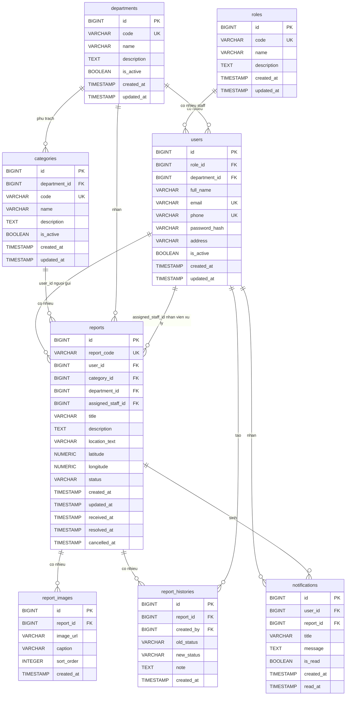

# 03. Thiết kế cơ sở dữ liệu CivicHub

## 1. Mục tiêu thiết kế cơ sở dữ liệu

Thiết kế cơ sở dữ liệu của CivicHub nhằm hỗ trợ các nghiệp vụ MVP đã được xác định trong tài liệu yêu cầu và use case:

- Quản lý tài khoản và phân quyền cơ bản theo vai trò.
- Quản lý đơn vị xử lý và nhân viên thuộc đơn vị.
- Quản lý danh mục phản ánh do quản trị viên cấu hình.
- Lưu trữ phản ánh do người dùng gửi, bao gồm nội dung, vị trí, trạng thái và người xử lý.
- Lưu hình ảnh đính kèm của phản ánh.
- Lưu lịch sử thay đổi trạng thái và ghi chú xử lý.
- Lưu thông báo nội bộ trong ứng dụng khi trạng thái phản ánh thay đổi.
- Phục vụ các màn hình danh sách, lọc, theo dõi trạng thái và dashboard MVP.

Thiết kế này chỉ phục vụ phạm vi MVP, không bao gồm AI, không mô tả API, không mô tả source code và không tạo migration SQL.

## 2. Danh sách bảng

| STT | Tên bảng | Mục đích |
| --- | --- | --- |
| 1 | `roles` | Lưu danh sách vai trò trong hệ thống. |
| 2 | `users` | Lưu tài khoản người dùng, nhân viên xử lý và quản trị viên. |
| 3 | `departments` | Lưu thông tin đơn vị xử lý phản ánh. |
| 4 | `categories` | Lưu danh mục phản ánh. |
| 5 | `reports` | Lưu thông tin phản ánh do người dùng gửi. |
| 6 | `report_images` | Lưu hình ảnh đính kèm của phản ánh. |
| 7 | `report_histories` | Lưu lịch sử cập nhật trạng thái và ghi chú xử lý. |
| 8 | `notifications` | Lưu thông báo nội bộ gửi đến người dùng. |

## 3. Mô tả chi tiết từng bảng

### 3.1. Bảng `roles`

**Mục đích:** Lưu các vai trò được sử dụng để phân quyền cơ bản trong hệ thống.

| Cột | Kiểu dữ liệu PostgreSQL | Ràng buộc | Mô tả |
| --- | --- | --- | --- |
| `id` | `BIGSERIAL` | Primary Key, Not Null | Khóa chính của vai trò. |
| `code` | `VARCHAR(50)` | Unique, Not Null | Mã vai trò, ví dụ `USER`, `STAFF`, `ADMIN`. |
| `name` | `VARCHAR(100)` | Not Null | Tên hiển thị của vai trò. |
| `description` | `TEXT` | Nullable | Mô tả vai trò. |
| `created_at` | `TIMESTAMP` | Not Null | Thời điểm tạo bản ghi. |
| `updated_at` | `TIMESTAMP` | Not Null | Thời điểm cập nhật gần nhất. |

**Khóa chính:**

- `id`.

**Unique:**

- `code`.

**Quan hệ:**

- Một `role` có nhiều `user`.

### 3.2. Bảng `users`

**Mục đích:** Lưu thông tin tài khoản của người dùng, nhân viên xử lý và quản trị viên.

| Cột | Kiểu dữ liệu PostgreSQL | Ràng buộc | Mô tả |
| --- | --- | --- | --- |
| `id` | `BIGSERIAL` | Primary Key, Not Null | Khóa chính của người dùng. |
| `role_id` | `BIGINT` | Foreign Key, Not Null | Tham chiếu đến `roles.id`. |
| `department_id` | `BIGINT` | Foreign Key, Nullable | Tham chiếu đến `departments.id`, áp dụng chủ yếu cho nhân viên xử lý. |
| `full_name` | `VARCHAR(150)` | Not Null | Họ tên người dùng. |
| `email` | `VARCHAR(150)` | Unique, Nullable | Email đăng nhập hoặc liên hệ. |
| `phone` | `VARCHAR(20)` | Unique, Nullable | Số điện thoại đăng nhập hoặc liên hệ. |
| `password_hash` | `VARCHAR(255)` | Not Null | Mật khẩu đã được lưu ở dạng mã hóa/băm. |
| `address` | `VARCHAR(255)` | Nullable | Địa chỉ liên hệ cơ bản. |
| `is_active` | `BOOLEAN` | Not Null | Trạng thái hoạt động của tài khoản. |
| `created_at` | `TIMESTAMP` | Not Null | Thời điểm tạo tài khoản. |
| `updated_at` | `TIMESTAMP` | Not Null | Thời điểm cập nhật gần nhất. |

**Khóa chính:**

- `id`.

**Khóa ngoại:**

- `role_id` tham chiếu `roles.id`.
- `department_id` tham chiếu `departments.id`.

**Unique:**

- `email`.
- `phone`.

**Not Null:**

- `id`, `role_id`, `full_name`, `password_hash`, `is_active`, `created_at`, `updated_at`.

**Quan hệ:**

- Một `role` có nhiều `user`.
- Một `department` có nhiều staff thông qua `users.department_id`.
- Một `user` có thể gửi nhiều `report`.
- Một staff có thể được gán xử lý nhiều `report`.
- Một `user` có thể tạo nhiều `report_history`.
- Một `user` nhận nhiều `notification`.

### 3.3. Bảng `departments`

**Mục đích:** Lưu thông tin các đơn vị phụ trách tiếp nhận và xử lý phản ánh.

| Cột | Kiểu dữ liệu PostgreSQL | Ràng buộc | Mô tả |
| --- | --- | --- | --- |
| `id` | `BIGSERIAL` | Primary Key, Not Null | Khóa chính của đơn vị xử lý. |
| `code` | `VARCHAR(50)` | Unique, Not Null | Mã đơn vị xử lý. |
| `name` | `VARCHAR(150)` | Not Null | Tên đơn vị xử lý. |
| `description` | `TEXT` | Nullable | Mô tả phạm vi phụ trách. |
| `is_active` | `BOOLEAN` | Not Null | Đơn vị còn hoạt động hay đã tạm ngưng. |
| `created_at` | `TIMESTAMP` | Not Null | Thời điểm tạo bản ghi. |
| `updated_at` | `TIMESTAMP` | Not Null | Thời điểm cập nhật gần nhất. |

**Khóa chính:**

- `id`.

**Unique:**

- `code`.

**Quan hệ:**

- Một `department` có nhiều staff.
- Một `department` phụ trách nhiều `category`.
- Một `department` nhận nhiều `report`.

### 3.4. Bảng `categories`

**Mục đích:** Lưu danh mục phản ánh để người dùng chọn khi gửi phản ánh và để hệ thống xác định đơn vị phụ trách ở mức MVP.

| Cột | Kiểu dữ liệu PostgreSQL | Ràng buộc | Mô tả |
| --- | --- | --- | --- |
| `id` | `BIGSERIAL` | Primary Key, Not Null | Khóa chính của danh mục. |
| `department_id` | `BIGINT` | Foreign Key, Not Null | Đơn vị phụ trách danh mục, tham chiếu `departments.id`. |
| `code` | `VARCHAR(50)` | Unique, Not Null | Mã danh mục. |
| `name` | `VARCHAR(150)` | Not Null | Tên danh mục phản ánh. |
| `description` | `TEXT` | Nullable | Mô tả danh mục. |
| `is_active` | `BOOLEAN` | Not Null | Danh mục còn sử dụng hay đã tạm ngưng. |
| `created_at` | `TIMESTAMP` | Not Null | Thời điểm tạo bản ghi. |
| `updated_at` | `TIMESTAMP` | Not Null | Thời điểm cập nhật gần nhất. |

**Khóa chính:**

- `id`.

**Khóa ngoại:**

- `department_id` tham chiếu `departments.id`.

**Unique:**

- `code`.

**Quan hệ:**

- Một `department` phụ trách nhiều `category`.
- Một `category` có nhiều `report`.

### 3.5. Bảng `reports`

**Mục đích:** Lưu thông tin phản ánh do người dùng gửi, trạng thái xử lý và đơn vị/nhân viên phụ trách.

| Cột | Kiểu dữ liệu PostgreSQL | Ràng buộc | Mô tả |
| --- | --- | --- | --- |
| `id` | `BIGSERIAL` | Primary Key, Not Null | Khóa chính của phản ánh. |
| `report_code` | `VARCHAR(30)` | Unique, Not Null | Mã phản ánh hiển thị cho người dùng và nhân viên, ví dụ `CH-2026-000001`. |
| `user_id` | `BIGINT` | Foreign Key, Not Null | Người gửi phản ánh, tham chiếu `users.id`. |
| `category_id` | `BIGINT` | Foreign Key, Not Null | Danh mục phản ánh, tham chiếu `categories.id`. |
| `department_id` | `BIGINT` | Foreign Key, Not Null | Đơn vị nhận phản ánh, tham chiếu `departments.id`. |
| `assigned_staff_id` | `BIGINT` | Foreign Key, Nullable | Nhân viên được gán xử lý, tham chiếu `users.id`. |
| `title` | `VARCHAR(200)` | Not Null | Tiêu đề phản ánh. |
| `description` | `TEXT` | Not Null | Nội dung mô tả phản ánh. |
| `location_text` | `VARCHAR(255)` | Not Null | Mô tả vị trí xảy ra sự việc. |
| `latitude` | `NUMERIC(10,7)` | Nullable | Vĩ độ nếu người dùng cung cấp vị trí tọa độ. |
| `longitude` | `NUMERIC(10,7)` | Nullable | Kinh độ nếu người dùng cung cấp vị trí tọa độ. |
| `status` | `VARCHAR(20)` | Not Null | Trạng thái phản ánh. |
| `created_at` | `TIMESTAMP` | Not Null | Thời điểm gửi phản ánh. |
| `updated_at` | `TIMESTAMP` | Not Null | Thời điểm cập nhật gần nhất. |
| `received_at` | `TIMESTAMP` | Nullable | Thời điểm phản ánh được chuyển sang trạng thái `RECEIVED`. |
| `resolved_at` | `TIMESTAMP` | Nullable | Thời điểm phản ánh được chuyển sang trạng thái `RESOLVED`. |
| `cancelled_at` | `TIMESTAMP` | Nullable | Thời điểm phản ánh được chuyển sang trạng thái `CANCELLED`. |

**Khóa chính:**

- `id`.

**Khóa ngoại:**

- `user_id` tham chiếu `users.id`.
- `category_id` tham chiếu `categories.id`.
- `department_id` tham chiếu `departments.id`.
- `assigned_staff_id` tham chiếu `users.id`.

**Not Null:**

- `id`, `report_code`, `user_id`, `category_id`, `department_id`, `title`, `description`, `location_text`, `status`, `created_at`, `updated_at`.

**Unique:**

- `report_code`.

**Giá trị trạng thái hợp lệ:**

- `PENDING`.
- `RECEIVED`.
- `PROCESSING`.
- `RESOLVED`.
- `REJECTED`.
- `CANCELLED`.

**Quan hệ:**

- Một `user` có thể gửi nhiều `report`.
- Một `category` có nhiều `report`.
- Một `department` nhận nhiều `report`.
- Một staff có thể được gán xử lý nhiều `report`.
- Một `report` có nhiều `image`.
- Một `report` có nhiều `history`.
- Một `report` có thể sinh nhiều `notification`.

### 3.6. Bảng `report_images`

**Mục đích:** Lưu thông tin hình ảnh đính kèm của phản ánh.

| Cột | Kiểu dữ liệu PostgreSQL | Ràng buộc | Mô tả |
| --- | --- | --- | --- |
| `id` | `BIGSERIAL` | Primary Key, Not Null | Khóa chính của hình ảnh. |
| `report_id` | `BIGINT` | Foreign Key, Not Null | Phản ánh chứa hình ảnh, tham chiếu `reports.id`. |
| `image_url` | `VARCHAR(500)` | Not Null | Đường dẫn hoặc định danh lưu trữ hình ảnh. |
| `caption` | `VARCHAR(255)` | Nullable | Ghi chú ngắn cho hình ảnh nếu có. |
| `sort_order` | `INTEGER` | Not Null | Thứ tự hiển thị hình ảnh trong phản ánh. |
| `created_at` | `TIMESTAMP` | Not Null | Thời điểm thêm hình ảnh. |

**Khóa chính:**

- `id`.

**Khóa ngoại:**

- `report_id` tham chiếu `reports.id`.

**Not Null:**

- `id`, `report_id`, `image_url`, `sort_order`, `created_at`.

**Quan hệ:**

- Một `report` có nhiều `report_image`.

### 3.7. Bảng `report_histories`

**Mục đích:** Lưu lịch sử thay đổi trạng thái, ghi chú tiếp nhận và ghi chú xử lý của phản ánh.

| Cột | Kiểu dữ liệu PostgreSQL | Ràng buộc | Mô tả |
| --- | --- | --- | --- |
| `id` | `BIGSERIAL` | Primary Key, Not Null | Khóa chính của lịch sử. |
| `report_id` | `BIGINT` | Foreign Key, Not Null | Phản ánh liên quan, tham chiếu `reports.id`. |
| `created_by` | `BIGINT` | Foreign Key, Not Null | Người tạo lịch sử, tham chiếu `users.id`. |
| `old_status` | `VARCHAR(20)` | Nullable | Trạng thái trước khi thay đổi. |
| `new_status` | `VARCHAR(20)` | Not Null | Trạng thái sau khi thay đổi. |
| `note` | `TEXT` | Nullable | Ghi chú xử lý hoặc lý do cập nhật. |
| `created_at` | `TIMESTAMP` | Not Null | Thời điểm tạo lịch sử. |

**Khóa chính:**

- `id`.

**Khóa ngoại:**

- `report_id` tham chiếu `reports.id`.
- `created_by` tham chiếu `users.id`.

**Not Null:**

- `id`, `report_id`, `created_by`, `new_status`, `created_at`.

**Quan hệ:**

- Một `report` có nhiều `report_history`.
- Một `user` có thể tạo nhiều `report_history`.

### 3.8. Bảng `notifications`

**Mục đích:** Lưu thông báo nội bộ trong ứng dụng cho người dùng khi phản ánh thay đổi trạng thái hoặc có cập nhật xử lý.

| Cột | Kiểu dữ liệu PostgreSQL | Ràng buộc | Mô tả |
| --- | --- | --- | --- |
| `id` | `BIGSERIAL` | Primary Key, Not Null | Khóa chính của thông báo. |
| `user_id` | `BIGINT` | Foreign Key, Not Null | Người nhận thông báo, tham chiếu `users.id`. |
| `report_id` | `BIGINT` | Foreign Key, Not Null | Phản ánh liên quan, tham chiếu `reports.id`. |
| `title` | `VARCHAR(200)` | Not Null | Tiêu đề thông báo. |
| `message` | `TEXT` | Not Null | Nội dung thông báo. |
| `is_read` | `BOOLEAN` | Not Null | Trạng thái đã đọc hay chưa đọc. |
| `created_at` | `TIMESTAMP` | Not Null | Thời điểm tạo thông báo. |
| `read_at` | `TIMESTAMP` | Nullable | Thời điểm người dùng đọc thông báo. |

**Khóa chính:**

- `id`.

**Khóa ngoại:**

- `user_id` tham chiếu `users.id`.
- `report_id` tham chiếu `reports.id`.

**Not Null:**

- `id`, `user_id`, `report_id`, `title`, `message`, `is_read`, `created_at`.

Trong phạm vi MVP, `notifications.report_id` luôn là Not Null vì mọi thông báo nội bộ đều liên quan đến một phản ánh cụ thể. Thông báo hệ thống chung chưa nằm trong phạm vi MVP.

**Quan hệ:**

- Một `user` nhận nhiều `notification`.
- Một `report` có thể sinh nhiều `notification`.

## 4. Quan hệ giữa các bảng

| Quan hệ | Mô tả | Cách thể hiện trong thiết kế |
| --- | --- | --- |
| Một role có nhiều user | Mỗi tài khoản có một vai trò chính. | `users.role_id` tham chiếu `roles.id`. |
| Một department có nhiều staff | Nhân viên xử lý thuộc một đơn vị. | `users.department_id` tham chiếu `departments.id`. |
| Một department phụ trách nhiều category | Mỗi danh mục được một đơn vị phụ trách trong MVP. | `categories.department_id` tham chiếu `departments.id`. |
| Một user có thể gửi nhiều report | Người dùng tạo nhiều phản ánh. | `reports.user_id` tham chiếu `users.id`. |
| Một category có nhiều report | Mỗi phản ánh thuộc một danh mục. | `reports.category_id` tham chiếu `categories.id`. |
| Một department nhận nhiều report | Phản ánh được chuyển đến đơn vị phụ trách. | `reports.department_id` tham chiếu `departments.id`. |
| Một staff có thể được gán xử lý nhiều report | Một nhân viên có thể xử lý nhiều phản ánh. | `reports.assigned_staff_id` tham chiếu `users.id`. |
| Một report có nhiều image | Phản ánh có thể có nhiều hình ảnh. | `report_images.report_id` tham chiếu `reports.id`. |
| Một report có nhiều history | Mỗi lần thay đổi trạng thái hoặc ghi chú tạo một lịch sử. | `report_histories.report_id` tham chiếu `reports.id`. |
| Một user có thể tạo nhiều history | Người gửi, nhân viên hoặc quản trị viên có thể tạo lịch sử theo nghiệp vụ. | `report_histories.created_by` tham chiếu `users.id`. |
| Một user nhận nhiều notification | Người dùng nhận thông báo nội bộ. | `notifications.user_id` tham chiếu `users.id`. |
| Một report có thể sinh nhiều notification | Một phản ánh có thể phát sinh nhiều thông báo theo các lần cập nhật. | `notifications.report_id` tham chiếu `reports.id`. |

## 5. Quy tắc nghiệp vụ liên quan đến dữ liệu

### 5.1. Quy tắc tài khoản và vai trò

- Mỗi `user` phải thuộc đúng một `role`.
- Các role MVP gồm `USER`, `STAFF`, `ADMIN`.
- Tài khoản có role `STAFF` bắt buộc phải có `department_id`.
- Tài khoản có role `USER` hoặc `ADMIN` có thể để `department_id` là null.
- Quy tắc bắt buộc `department_id` theo role là quy tắc nghiệp vụ được backend kiểm tra.
- Mỗi tài khoản phải có ít nhất một trong hai thông tin `email` hoặc `phone`.
- Không cho phép cả `email` và `phone` cùng null.
- Tài khoản bị khóa hoặc ngưng hoạt động được thể hiện bằng `users.is_active = false`.
- Mật khẩu chỉ lưu dạng `password_hash`, không lưu mật khẩu văn bản thuần.

### 5.2. Quy tắc phòng ban và danh mục

- Một `department` có thể phụ trách nhiều `category`.
- Một `category` trong MVP thuộc một `department`.
- Khi người dùng gửi phản ánh theo một `category`, `reports.department_id` được xác định theo đơn vị phụ trách danh mục đó ở thời điểm tạo phản ánh.
- Danh mục hoặc đơn vị không còn sử dụng được đánh dấu bằng `is_active = false`, không cần xóa vật lý trong MVP.

### 5.3. Quy tắc phản ánh

- Mỗi `report` bắt buộc có người gửi, danh mục, đơn vị nhận, tiêu đề, nội dung mô tả, vị trí và trạng thái.
- Mỗi `report` bắt buộc có `report_code` duy nhất để hiển thị và tra cứu ở mức người dùng.
- Trạng thái ban đầu của phản ánh mới là `PENDING`.
- Người dùng chỉ được hủy phản ánh khi trạng thái hiện tại là `PENDING`.
- Khi phản ánh được hủy, trạng thái chuyển thành `CANCELLED` và ghi nhận `cancelled_at`.
- Nhân viên chỉ tiếp nhận phản ánh khi trạng thái hiện tại là `PENDING`.
- Khi nhân viên tiếp nhận phản ánh, trạng thái chuyển thành `RECEIVED`, ghi nhận `received_at` và có thể ghi nhận `assigned_staff_id`.
- `received_at` chỉ ghi khi phản ánh chuyển sang trạng thái `RECEIVED`.
- `resolved_at` chỉ ghi khi phản ánh chuyển sang trạng thái `RESOLVED`.
- `cancelled_at` chỉ ghi khi phản ánh chuyển sang trạng thái `CANCELLED`.
- Trạng thái `REJECTED` không dùng `resolved_at`; thời điểm từ chối được xác định qua `updated_at` và bản ghi tương ứng trong `report_histories`.
- Phản ánh ở trạng thái `CANCELLED`, `RESOLVED` hoặc `REJECTED` không tiếp tục đi vào luồng xử lý.

### 5.4. Quy tắc luồng trạng thái hợp lệ

Các luồng trạng thái hợp lệ của `reports.status`:

| Trạng thái hiện tại | Trạng thái kế tiếp hợp lệ | Ý nghĩa |
| --- | --- | --- |
| `PENDING` | `RECEIVED` | Nhân viên tiếp nhận phản ánh. |
| `PENDING` | `CANCELLED` | Người dùng hủy phản ánh trước khi được tiếp nhận. |
| `RECEIVED` | `PROCESSING` | Nhân viên bắt đầu xử lý. |
| `RECEIVED` | `REJECTED` | Đơn vị từ chối xử lý sau khi xem xét. |
| `PROCESSING` | `RESOLVED` | Phản ánh đã được xử lý xong. |
| `PROCESSING` | `REJECTED` | Phản ánh bị từ chối trong quá trình xử lý. |

Các trạng thái ngoài luồng trên không được xem là hợp lệ trong MVP.

### 5.5. Quy tắc lịch sử xử lý

- Mỗi lần trạng thái phản ánh thay đổi phải tạo một bản ghi trong `report_histories`.
- `old_status` lưu trạng thái trước khi thay đổi; với lịch sử đầu tiên có thể để trống.
- `new_status` lưu trạng thái sau khi thay đổi.
- `created_by` là người thực hiện thao tác tạo lịch sử.
- Ghi chú xử lý, lý do từ chối hoặc nội dung cập nhật tiến độ được lưu ở `note`.

### 5.6. Quy tắc thông báo nội bộ

- Khi trạng thái phản ánh thay đổi, hệ thống có thể tạo bản ghi trong `notifications` cho người gửi phản ánh.
- Thông báo trong MVP là thông báo nội bộ trong ứng dụng, không phải Push Notification.
- Một thông báo thuộc về một người nhận và liên quan đến một phản ánh.
- Mọi `notification` trong MVP đều liên quan đến một `report` thông qua `notifications.report_id`.
- Thông báo hệ thống chung chưa nằm trong phạm vi MVP.
- `is_read` cho biết thông báo đã được người dùng đọc hay chưa.

## 6. Index đề xuất

Các index dưới đây nhằm hỗ trợ các màn hình danh sách, lọc và dashboard MVP. Đây là đề xuất thiết kế, không phải migration SQL.

| Bảng | Cột đề xuất index | Mục đích |
| --- | --- | --- |
| `roles` | `code` | Tìm vai trò theo mã. |
| `users` | `role_id` | Lọc tài khoản theo vai trò. |
| `users` | `department_id` | Lấy danh sách nhân viên theo đơn vị. |
| `users` | `email` | Đăng nhập hoặc kiểm tra trùng email. |
| `users` | `phone` | Đăng nhập hoặc kiểm tra trùng số điện thoại. |
| `departments` | `code` | Tìm đơn vị theo mã. |
| `categories` | `department_id` | Lấy danh mục theo đơn vị phụ trách. |
| `categories` | `code` | Tìm danh mục theo mã. |
| `reports` | `report_code` | Tra cứu phản ánh theo mã hiển thị. |
| `reports` | `user_id` | Lấy danh sách phản ánh của một người dùng. |
| `reports` | `category_id` | Lọc phản ánh theo danh mục. |
| `reports` | `department_id` | Lọc phản ánh theo đơn vị xử lý. |
| `reports` | `assigned_staff_id` | Lấy danh sách phản ánh theo nhân viên xử lý. |
| `reports` | `status` | Lọc và thống kê phản ánh theo trạng thái. |
| `reports` | `created_at` | Sắp xếp phản ánh mới nhất và lấy 5 phản ánh mới nhất. |
| `reports` | `department_id`, `status` | Hỗ trợ màn hình danh sách của nhân viên theo đơn vị và trạng thái. |
| `reports` | `category_id`, `status` | Hỗ trợ dashboard và lọc theo danh mục/trạng thái. |
| `report_images` | `report_id` | Lấy hình ảnh theo phản ánh. |
| `report_histories` | `report_id` | Lấy lịch sử xử lý của phản ánh. |
| `report_histories` | `created_by` | Lọc lịch sử theo người thao tác khi cần kiểm tra. |
| `notifications` | `user_id`, `is_read` | Lấy thông báo chưa đọc của người dùng. |
| `notifications` | `report_id` | Lấy thông báo phát sinh từ một phản ánh. |
| `notifications` | `created_at` | Sắp xếp thông báo mới nhất. |

## 7. Dữ liệu mẫu cho role, category và trạng thái

### 7.1. Dữ liệu mẫu cho `roles`

| `code` | `name` | Mô tả |
| --- | --- | --- |
| `USER` | Người dùng | Người dân hoặc thành viên cộng đồng gửi và theo dõi phản ánh. |
| `STAFF` | Nhân viên xử lý | Nhân viên thuộc đơn vị xử lý phản ánh. |
| `ADMIN` | Quản trị viên | Người quản lý tài khoản, danh mục, đơn vị và dashboard hệ thống. |

### 7.2. Dữ liệu mẫu cho `categories`

Các danh mục dưới đây là dữ liệu mẫu cho MVP. Mỗi danh mục cần được gán với một đơn vị phụ trách phù hợp trong bảng `departments`.

| `code` | `name` | Gợi ý đơn vị phụ trách |
| --- | --- | --- |
| `TRAFFIC_ROAD` | Giao thông và đường bộ | Đơn vị phụ trách giao thông hoặc hạ tầng đường bộ. |
| `PUBLIC_LIGHTING` | Chiếu sáng công cộng | Đơn vị phụ trách chiếu sáng công cộng. |
| `ENVIRONMENT_SANITATION` | Vệ sinh môi trường | Đơn vị phụ trách môi trường hoặc vệ sinh đô thị. |
| `PUBLIC_SECURITY` | An ninh trật tự | Đơn vị phụ trách an ninh trật tự. |
| `TREES` | Cây xanh | Đơn vị phụ trách cây xanh. |
| `DRAINAGE_FLOODING` | Thoát nước và ngập úng | Đơn vị phụ trách thoát nước hoặc hạ tầng kỹ thuật. |
| `OTHER` | Khác | Đơn vị tiếp nhận chung hoặc đơn vị được quản trị viên cấu hình. |

### 7.3. Dữ liệu mẫu cho trạng thái phản ánh

Trạng thái phản ánh được lưu trong cột `reports.status` và các cột trạng thái của `report_histories`.

| Mã trạng thái | Tên tiếng Việt | Ý nghĩa |
| --- | --- | --- |
| `PENDING` | Chờ tiếp nhận | Phản ánh mới được gửi, chưa được nhân viên tiếp nhận. |
| `RECEIVED` | Đã tiếp nhận | Phản ánh đã được nhân viên tiếp nhận. |
| `PROCESSING` | Đang xử lý | Phản ánh đang trong quá trình xử lý. |
| `RESOLVED` | Đã xử lý | Phản ánh đã được xử lý xong. |
| `REJECTED` | Từ chối xử lý | Phản ánh bị từ chối xử lý. |
| `CANCELLED` | Đã hủy | Người dùng đã hủy phản ánh khi còn ở trạng thái chờ tiếp nhận. |

## 8. ERD bằng Mermaid

