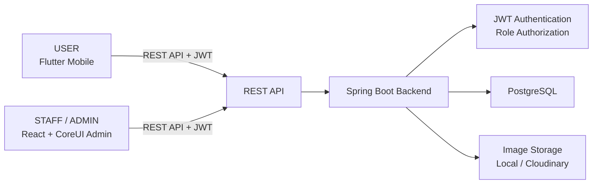

# 05. Tài liệu kiến trúc hệ thống CivicHub

## 1. Mục tiêu kiến trúc

Kiến trúc CivicHub MVP được thiết kế để hỗ trợ hệ thống tiếp nhận, quản lý và theo dõi phản ánh cộng đồng theo phạm vi đã xác định trong các tài liệu yêu cầu, use case, database và API.

Mục tiêu chính của kiến trúc:

- Đáp ứng đầy đủ các nghiệp vụ cốt lõi của MVP trong thời gian thực hiện khoảng một tháng.
- Giữ mô hình đơn giản, dễ triển khai bởi một sinh viên hoặc một nhóm nhỏ.
- Tách rõ trách nhiệm giữa ứng dụng mobile, trang quản trị, backend và cơ sở dữ liệu.
- Dễ kiểm thử từng phần: frontend, backend API, nghiệp vụ và dữ liệu.
- Dễ bảo trì, dễ mở rộng sau MVP mà không làm phức tạp phiên bản hiện tại.
- Sử dụng đúng công nghệ đã chốt: Flutter, React + CoreUI, Spring Boot, PostgreSQL và JWT Bearer Token.

Trong MVP, hệ thống không triển khai AI, microservice, hàng đợi sự kiện phức tạp hoặc các thành phần hạ tầng vượt quá nhu cầu hiện tại.

## 2. Kiến trúc tổng thể

CivicHub sử dụng mô hình client-server ba lớp đơn giản:

### 2.1. Presentation Layer

Presentation Layer gồm các client trực tiếp tương tác với người dùng:

- Flutter Mobile: dành cho `USER`, hỗ trợ đăng ký, đăng nhập, gửi phản ánh, xem phản ánh, hủy phản ánh và xem thông báo.
- React + CoreUI Admin: dành cho `STAFF` và `ADMIN`, hỗ trợ xử lý phản ánh, dashboard và các chức năng quản trị.

Các client không truy cập trực tiếp database. Mọi thao tác dữ liệu đều đi qua REST API của backend.

### 2.2. Application/Business Layer

Application/Business Layer là Spring Boot Backend.

Backend chịu trách nhiệm:

- Cung cấp REST API dùng chung cho Flutter Mobile và React Admin.
- Xác thực và phân quyền bằng JWT Bearer Token.
- Xử lý nghiệp vụ gửi phản ánh, hủy phản ánh, tiếp nhận và cập nhật trạng thái.
- Quản lý người dùng, danh mục, đơn vị xử lý, thông báo và dashboard.
- Kiểm soát transaction, concurrency và response lỗi thống nhất.
- Tích hợp với nơi lưu trữ hình ảnh.

### 2.3. Data Layer

Data Layer gồm:

- PostgreSQL: lưu dữ liệu nghiệp vụ chính như users, roles, departments, categories, reports, report_images, report_histories và notifications.
- Image Storage: lưu file ảnh phản ánh ở local storage trong môi trường phát triển hoặc dịch vụ lưu trữ ảnh bên ngoài trong môi trường demo/production.

Database chỉ lưu metadata và đường dẫn ảnh, không lưu binary ảnh trực tiếp.

## 3. Sơ đồ kiến trúc tổng thể bằng Mermaid



## 4. Kiến trúc frontend

### 4.1. Flutter Mobile

Flutter Mobile là ứng dụng dành cho `USER`. Ứng dụng tập trung vào các nghiệp vụ người dùng phổ thông, giao diện đơn giản và dễ thao tác.

Các module hoặc màn hình chính:

- Authentication:
  - Đăng ký.
  - Đăng nhập.
  - Đăng xuất.
  - Đổi mật khẩu.
- Profile:
  - Xem thông tin cá nhân.
  - Cập nhật thông tin cá nhân.
- Category:
  - Lấy danh mục phản ánh đang khả dụng để người dùng chọn khi gửi phản ánh.
  - Gọi API `GET /api/categories` để lấy các category đang hoạt động và có department liên quan còn hoạt động.
- Report creation:
  - Nhập tiêu đề, nội dung, danh mục, vị trí.
  - Đính kèm hình ảnh nếu có.
  - Gửi phản ánh lên backend.
- My reports:
  - Xem danh sách phản ánh của chính người dùng.
  - Tìm kiếm và lọc theo trạng thái.
- Report detail:
  - Xem chi tiết phản ánh.
  - Xem trạng thái, hình ảnh, ghi chú và lịch sử cập nhật cơ bản.
  - Hủy phản ánh nếu còn ở trạng thái `PENDING`.
- Notification:
  - Xem thông báo nội bộ.
  - Đánh dấu thông báo đã đọc.

Flutter gọi REST API thông qua HTTP client. Mọi API yêu cầu đăng nhập cần gửi JWT trong header:

```text
Authorization: Bearer {accessToken}
```

Access token nên được lưu trong secure storage của mobile để hạn chế rủi ro lộ token. Khi người dùng đăng xuất, ứng dụng xóa access token khỏi thiết bị.

### 4.2. React Admin

React Admin sử dụng React kết hợp CoreUI để xây dựng giao diện quản trị trên trình duyệt cho `STAFF` và `ADMIN`.

Các module chính:

- Login:
  - Đăng nhập cho nhân viên và quản trị viên.
  - Lưu access token phía client sau khi đăng nhập thành công.
- Dashboard:
  - Dành cho `ADMIN`.
  - Hiển thị tổng số phản ánh, số lượng theo trạng thái, biểu đồ theo danh mục và 5 phản ánh mới nhất.
- Report management:
  - Dành cho `ADMIN`.
  - Xem, lọc và theo dõi toàn bộ phản ánh.
- Staff work management:
  - Dành cho `STAFF`.
  - Xem phản ánh thuộc department của mình.
  - Tiếp nhận phản ánh.
  - Chuyển trạng thái xử lý và ghi chú.
  - Xem công việc xử lý cá nhân.
- Account management:
  - Dành cho `ADMIN`.
  - Quản lý tài khoản người dùng, nhân viên và quản trị viên.
- Category management:
  - Dành cho `ADMIN`.
  - Quản lý danh mục phản ánh và đơn vị phụ trách danh mục.
- Department management:
  - Dành cho `ADMIN`.
  - Quản lý đơn vị xử lý.

Phân quyền frontend:

- `STAFF` chỉ truy cập các màn hình xử lý phản ánh thuộc đơn vị của mình.
- `ADMIN` truy cập dashboard và các chức năng quản trị.
- Frontend có thể ẩn menu không phù hợp theo role, nhưng backend vẫn là nơi kiểm tra quyền cuối cùng.

## 5. Kiến trúc backend Spring Boot

Backend Spring Boot sử dụng layered architecture để tách rõ trách nhiệm và giữ hệ thống dễ bảo trì.

### 5.1. Controller

Controller là tầng tiếp nhận request từ Flutter Mobile và React Admin.

Trách nhiệm:

- Nhận HTTP request.
- Đọc path variable, query parameter và request body.
- Validate cơ bản dữ liệu đầu vào.
- Gọi Service tương ứng.
- Trả response theo format thống nhất trong `docs/04-api.md`.

Controller không xử lý nghiệp vụ phức tạp và không truy cập trực tiếp Repository.

### 5.2. Service

Service là tầng xử lý nghiệp vụ chính.

Trách nhiệm:

- Xử lý đăng ký, đăng nhập, đổi mật khẩu.
- Kiểm tra quyền nghiệp vụ như user chỉ xem report của mình, staff chỉ xử lý report thuộc department.
- Tạo report, sinh `reportCode`, xác định department từ category.
- Kiểm tra và chuyển trạng thái hợp lệ.
- Tạo history và notification khi trạng thái thay đổi.
- Điều phối transaction cho các nghiệp vụ cần tính toàn vẹn dữ liệu.

### 5.3. Repository

Repository là tầng truy cập PostgreSQL.

Trách nhiệm:

- Truy vấn dữ liệu theo ID, role, department, category, status và các điều kiện lọc.
- Lưu, cập nhật và đọc các entity.
- Hỗ trợ phân trang cho danh sách phản ánh, tài khoản, danh mục, đơn vị và thông báo.

Repository không chứa nghiệp vụ phức tạp.

### 5.4. Entity

Entity ánh xạ với các bảng trong PostgreSQL:

- `roles`
- `users`
- `departments`
- `categories`
- `reports`
- `report_images`
- `report_histories`
- `notifications`

Entity chỉ đại diện cho cấu trúc dữ liệu lưu trữ và quan hệ dữ liệu. Backend không trả Entity trực tiếp ra API response.

### 5.5. DTO

DTO dùng cho request và response.

Trách nhiệm:

- Request DTO nhận dữ liệu từ client.
- Response DTO trả dữ liệu ra client theo đúng API contract.
- Ẩn các trường nhạy cảm như `password_hash`.
- Tránh để client phụ thuộc trực tiếp vào cấu trúc Entity/database.

### 5.6. Mapper

Mapper chuyển đổi giữa Entity và DTO.

Trách nhiệm:

- Chuyển request DTO thành Entity hoặc dữ liệu trung gian cho Service.
- Chuyển Entity thành response DTO.
- Giữ Controller và Service gọn hơn, tránh lặp logic chuyển đổi dữ liệu.

### 5.7. Security

Security xử lý xác thực và phân quyền.

Trách nhiệm:

- Xác thực JWT Bearer Token.
- JWT ưu tiên chứa `userId` và `role`.
- Kiểm tra quyền truy cập theo role `USER`, `STAFF`, `ADMIN`.
- Trạng thái tài khoản và department hiện tại của `STAFF` phải được kiểm tra lại từ database khi xử lý nghiệp vụ quan trọng.
- Không xem `departmentId` trong token là nguồn dữ liệu cuối cùng.
- Bảo vệ endpoint theo API contract.
- Kết hợp với Service để kiểm tra quyền nghiệp vụ chi tiết.

### 5.8. Exception Handling

Exception Handling trả lỗi thống nhất cho toàn hệ thống.

Trách nhiệm:

- Bắt lỗi validation.
- Bắt lỗi không xác thực, không đủ quyền.
- Bắt lỗi không tìm thấy dữ liệu.
- Bắt lỗi xung đột trạng thái hoặc dữ liệu trùng.
- Trả response lỗi theo format trong `docs/04-api.md`.

## 6. Đề xuất cấu trúc package backend

Cấu trúc package đề xuất:

```text
com.civichub
├── auth
├── user
├── report
├── category
├── department
├── notification
├── dashboard
├── security
├── common
└── config
```

Trong từng module nghiệp vụ có thể tổ chức theo các nhóm:

```text
module
├── controller
├── service
├── repository
├── dto
├── entity
└── mapper
```

Gợi ý trách nhiệm từng package:

| Package | Trách nhiệm |
| --- | --- |
| `auth` | Đăng ký, đăng nhập, đăng xuất, đổi mật khẩu. |
| `user` | Thông tin cá nhân, quản lý tài khoản. |
| `report` | Tạo, xem, hủy, tiếp nhận và cập nhật trạng thái phản ánh. |
| `category` | Quản lý danh mục phản ánh. |
| `department` | Quản lý đơn vị xử lý. |
| `notification` | Thông báo nội bộ trong ứng dụng. |
| `dashboard` | Tổng hợp số liệu dashboard MVP. |
| `security` | JWT, authentication, authorization. |
| `common` | Response chuẩn, exception, constants, helper dùng chung. |
| `config` | Cấu hình ứng dụng ở mức Spring Boot. |

Không bắt buộc mọi module đều có đầy đủ toàn bộ thư mục con nếu module đó đơn giản trong MVP.

Nguyên tắc tổ chức dependency:

- Entity thuộc module sở hữu dữ liệu chính, ví dụ `Report` thuộc module `report`, `Category` thuộc module `category`.
- Các module có thể tham chiếu entity hoặc repository cần thiết để phục vụ nghiệp vụ MVP.
- Tránh dependency vòng giữa các Service; nếu cần phối hợp nhiều module, nên để Service sở hữu nghiệp vụ chính điều phối.

## 7. Luồng xác thực và phân quyền

Luồng xác thực:

1. Người dùng gửi `username` và `password` qua API đăng nhập.
2. Backend xác thực tài khoản.
3. Backend kiểm tra tài khoản còn hoạt động.
4. Backend tạo JWT access token.
5. Client lưu token.
6. Client gửi token qua header `Authorization: Bearer {accessToken}` khi gọi API cần đăng nhập.
7. Backend kiểm tra token và role.
8. Backend cho phép hoặc từ chối truy cập.

Vai trò trong MVP:

- `USER`: gửi phản ánh, xem phản ánh của mình, hủy phản ánh khi còn `PENDING`, xem thông báo.
- `STAFF`: xem và xử lý phản ánh thuộc department của mình.
- `ADMIN`: quản lý tài khoản, danh mục, department, dashboard và xem toàn bộ phản ánh.

Làm rõ phạm vi MVP:

- MVP dùng stateless JWT.
- JWT ưu tiên chứa `userId` và `role`.
- Không dùng refresh token.
- Không dùng token blacklist.
- Không lưu session trong database.
- Logout chủ yếu là client xóa access token.
- Backend vẫn có API logout để thống nhất luồng nghiệp vụ, nhưng không phụ thuộc vào session server-side.
- Với nghiệp vụ quan trọng, backend kiểm tra lại trạng thái tài khoản và department hiện tại từ database, đặc biệt với `STAFF`.

## 8. Luồng gửi phản ánh

Luồng gửi phản ánh của `USER`:

1. `USER` nhập thông tin phản ánh trên Flutter Mobile gồm tiêu đề, nội dung, danh mục, vị trí và hình ảnh nếu có.
2. Flutter gọi `GET /api/categories` để lấy danh mục đang hoạt động cho người dùng chọn nếu chưa có dữ liệu danh mục mới nhất.
3. Flutter gửi dữ liệu và ảnh đến REST API `POST /api/reports`.
4. Backend kiểm tra dữ liệu bắt buộc và quyền truy cập.
5. Backend kiểm tra category còn hoạt động và department liên quan còn hoạt động.
6. Backend lấy department phụ trách từ category.
7. Backend sinh `reportCode`, ví dụ `CH-2026-000001`.
8. Backend lưu report với trạng thái ban đầu `PENDING`.
9. Backend upload hoặc lưu ảnh vào Image Storage nếu có.
10. Backend lưu metadata ảnh vào `report_images`, gồm `image_url`, `caption`, `sort_order`.
11. Backend tạo `report_history` đầu tiên nếu phù hợp, ghi nhận report được tạo ở trạng thái `PENDING`.
12. Backend trả kết quả cho Flutter gồm ID, `reportCode`, trạng thái và thời điểm tạo.

Phần dữ liệu PostgreSQL của nghiệp vụ tạo report và metadata ảnh cần được xử lý trong transaction để tránh tình trạng report tạo dở hoặc thiếu metadata ảnh. File ảnh ở local hoặc external storage cần được cleanup riêng nếu nghiệp vụ thất bại.

## 9. Luồng tiếp nhận và xử lý phản ánh

Luồng xử lý của `STAFF`:

1. `STAFF` đăng nhập React Admin.
2. `STAFF` xem danh sách report thuộc department của mình qua `GET /api/staff/reports`.
3. `STAFF` mở chi tiết report qua `GET /api/reports/{id}`.
4. `STAFF` tiếp nhận report đang ở trạng thái `PENDING`.
5. Backend kiểm tra report thuộc department của staff và trạng thái hiện tại vẫn là `PENDING`.
6. Backend chuyển trạng thái sang `RECEIVED`.
7. Backend gán `assigned_staff_id`.
8. Backend ghi `received_at`.
9. Backend tạo `report_history`.
10. Backend tạo `notification` cho người gửi phản ánh.
11. `STAFF` chuyển report sang `PROCESSING` khi bắt đầu xử lý.
12. `STAFF` hoàn tất bằng `RESOLVED` hoặc `REJECTED`.
13. Backend lưu `note`, `report_history`, `notification` và thời gian tương ứng.

Luồng trạng thái hợp lệ:

- `PENDING -> RECEIVED`
- `PENDING -> CANCELLED`
- `RECEIVED -> PROCESSING`
- `RECEIVED -> REJECTED`
- `PROCESSING -> RESOLVED`
- `PROCESSING -> REJECTED`

Quy tắc thời gian:

- `received_at` chỉ ghi khi chuyển sang `RECEIVED`.
- `resolved_at` chỉ ghi khi chuyển sang `RESOLVED`.
- `cancelled_at` chỉ ghi khi chuyển sang `CANCELLED`.
- `REJECTED` không dùng `resolved_at`; thời điểm từ chối xác định qua `updated_at` và `report_histories`.

## 10. Kiến trúc lưu trữ hình ảnh

Ảnh phản ánh không lưu binary trực tiếp trong PostgreSQL.

### 10.1. Development

Trong môi trường development, hệ thống có thể lưu ảnh:

- Trong thư mục local như `uploads`.
- Trong một thư mục static phục vụ thử nghiệm.

Cách này đơn giản, dễ triển khai local và phù hợp cho quá trình thực tập.

### 10.2. Production/demo

Trong môi trường demo hoặc production đơn giản, hệ thống có thể dùng:

- Cloudinary.
- Dịch vụ lưu trữ ảnh tương tự.

Backend chịu trách nhiệm upload ảnh và nhận URL trả về từ dịch vụ lưu trữ.

Database chỉ lưu:

- `image_url`
- `caption`
- `sort_order`

Lưu ý về rollback ảnh:

- Database transaction chỉ rollback dữ liệu PostgreSQL.
- Upload ảnh lên Cloudinary hoặc external storage không tự rollback cùng database.
- Nếu upload ảnh thành công nhưng lưu report thất bại, backend cần cố gắng xóa ảnh đã upload hoặc ghi log để cleanup sau.
- Trong development local, backend cũng cần xóa file đã lưu nếu nghiệp vụ tạo report thất bại.

## 11. Xử lý transaction

Các nghiệp vụ sau phải chạy trong transaction:

- Tạo report và `report_images`.
- Tiếp nhận report, cập nhật report, tạo history và notification.
- Cập nhật trạng thái report, tạo history và notification.
- Hủy report và tạo history.

Nguyên tắc:

- Nếu tất cả bước thành công thì commit transaction.
- Nếu một bước thất bại thì rollback toàn bộ nghiệp vụ.
- Không để report chuyển trạng thái nhưng thiếu history hoặc notification cần thiết.
- Không để metadata ảnh được lưu khi report tạo thất bại.
- Database transaction chỉ đảm bảo rollback dữ liệu PostgreSQL, không tự rollback file ảnh đã lưu ở local hoặc ảnh đã upload lên external storage.
- Với nghiệp vụ tạo report có ảnh, nếu database rollback sau khi ảnh đã được lưu/upload, backend cần cố gắng xóa ảnh tương ứng hoặc ghi log để cleanup.

## 12. Xử lý concurrency

Vấn đề cần xử lý trong MVP là hai `STAFF` cùng tiếp nhận một report đang ở trạng thái `PENDING`.

Yêu cầu:

- Backend phải kiểm tra lại trạng thái report trong transaction.
- Chỉ một nhân viên được tiếp nhận thành công.
- Nhân viên còn lại nhận lỗi `409 Conflict`.
- Có thể dùng optimistic locking hoặc update có điều kiện theo trạng thái hiện tại.
- Không cần triển khai cơ chế phân tán phức tạp.

Ví dụ logic nghiệp vụ ở mức mô tả:

- Chỉ cho phép tiếp nhận nếu report hiện tại vẫn là `PENDING`.
- Sau khi một transaction chuyển report sang `RECEIVED`, các request tiếp nhận sau đó không còn hợp lệ.

## 13. Logging và xử lý lỗi

### 13.1. Logging

Backend cần log các thông tin quan trọng để hỗ trợ kiểm tra lỗi:

- Request đăng nhập thất bại ở mức an toàn.
- Lỗi tạo report.
- Lỗi upload ảnh.
- Lỗi chuyển trạng thái report.
- Lỗi phân quyền.
- Lỗi hệ thống không mong muốn.

Không log:

- Mật khẩu.
- `password_hash`.
- JWT đầy đủ.
- Toàn bộ request body.
- Multipart file.
- Dữ liệu nhạy cảm không cần thiết.

Ưu tiên log:

- `requestId`.
- Endpoint.
- `userId`.
- `reportCode` nếu nghiệp vụ liên quan đến phản ánh.
- Error code hoặc exception type đã được chuẩn hóa.

### 13.2. Xử lý lỗi

Backend sử dụng global exception handler để trả response lỗi thống nhất theo `docs/04-api.md`.

Các HTTP status cần dùng đúng ngữ nghĩa:

| HTTP Status | Trường hợp |
| --- | --- |
| `400 Bad Request` | Request thiếu dữ liệu, sai định dạng hoặc vi phạm rule đầu vào. |
| `401 Unauthorized` | Chưa đăng nhập hoặc token không hợp lệ. |
| `403 Forbidden` | Không có quyền truy cập tài nguyên hoặc chức năng. |
| `404 Not Found` | Không tìm thấy dữ liệu. |
| `409 Conflict` | Xung đột dữ liệu hoặc trạng thái, ví dụ hai staff cùng tiếp nhận một report. |
| `500 Internal Server Error` | Lỗi hệ thống không mong muốn. |

Response lỗi phải theo format chuẩn đã mô tả trong tài liệu API.

## 14. Deployment cho MVP

Phương án deployment MVP ưu tiên đơn giản:

- Flutter Mobile:
  - Chạy trên Android emulator hoặc thiết bị Android thật.
  - Kết nối đến backend qua URL môi trường local hoặc demo.
- React Admin:
  - Chạy trên trình duyệt.
  - Có thể chạy local trong quá trình phát triển hoặc build static để demo.
- Spring Boot Backend:
  - Có thể chạy local trong môi trường phát triển.
  - Có thể deploy lên một dịch vụ cloud đơn giản khi demo.
- PostgreSQL:
  - Có thể chạy local.
  - Có thể chạy bằng Docker trong môi trường phát triển.
  - Có thể dùng dịch vụ database cloud đơn giản khi demo.
- Image Storage:
  - Dùng local storage trong development.
  - Dùng Cloudinary hoặc dịch vụ tương tự khi demo.

Không yêu cầu Kubernetes, Kafka, Redis hoặc microservice cho MVP.

## 15. Kiến trúc không sử dụng trong MVP

CivicHub MVP không sử dụng các kiến trúc hoặc công nghệ sau:

- Microservices.
- Kafka.
- Redis.
- Kubernetes.
- Event-driven architecture phức tạp.
- API Gateway.
- Service Discovery.
- AI service.
- Elasticsearch.

Các thành phần trên có thể hữu ích cho hệ thống lớn hơn, nhưng không phù hợp với phạm vi một tháng và nguồn lực phát triển của MVP hiện tại.

## 16. Mapping kiến trúc với các tài liệu trước

### 16.1. Requirement -> Thành phần kiến trúc

| Requirement | Thành phần kiến trúc |
| --- | --- |
| USER đăng ký, đăng nhập | Flutter Authentication Module + Spring Boot Auth Module |
| USER quản lý hồ sơ | Flutter Profile Module + User Service |
| USER gửi phản ánh | Flutter Report Creation Module + Report Service + Image Storage |
| USER theo dõi phản ánh | Flutter My Reports/Report Detail Module + Report Service |
| USER xem thông báo | Flutter Notification Module + Notification Service |
| STAFF tiếp nhận và xử lý phản ánh | React Staff Work Management + Report Service |
| ADMIN quản lý tài khoản | React Account Management + User Service |
| ADMIN quản lý danh mục | React Category Management + Category Service |
| ADMIN quản lý đơn vị xử lý | React Department Management + Department Service |
| ADMIN xem dashboard | React Dashboard + Dashboard Service |

### 16.2. Use Case -> Module xử lý

| Use Case | Module xử lý |
| --- | --- |
| UC-USER-01, UC-USER-02, UC-USER-03, UC-USER-05 | Auth Module |
| UC-USER-04 | User Module |
| UC-USER-06, UC-USER-07, UC-USER-08, UC-USER-09, UC-USER-10 | Report Module |
| UC-USER-11 | Notification Module |
| UC-STAFF-02, UC-STAFF-03, UC-STAFF-04, UC-STAFF-05, UC-STAFF-06, UC-STAFF-07 | Report Module + Staff Work Management |
| UC-ADMIN-02 | User Module |
| UC-ADMIN-03 | Category Module |
| UC-ADMIN-04 | Department Module |
| UC-ADMIN-05, UC-ADMIN-06 | Report Module |
| UC-ADMIN-07 | Dashboard Module |

### 16.3. Database table -> Backend module

| Database table | Backend module |
| --- | --- |
| `roles` | Security/Auth Module |
| `users` | User Module + Auth Module |
| `departments` | Department Module |
| `categories` | Category Module |
| `reports` | Report Module |
| `report_images` | Report Module + Image Storage integration |
| `report_histories` | Report Module |
| `notifications` | Notification Module |

### 16.4. API group -> Client sử dụng

| API group | Client sử dụng |
| --- | --- |
| Authentication API | Flutter Mobile, React Admin |
| User API | Flutter Mobile, React Admin |
| Category API | Flutter Mobile |
| Report API | Flutter Mobile, React Admin |
| Notification API | Flutter Mobile |
| Staff API | React Admin cho `STAFF` |
| Admin API | React Admin cho `ADMIN` |

### 16.5. Mapping tổng hợp

| Thành phần | Module |
| --- | --- |
| USER gửi phản ánh | Flutter Report Module + Spring Boot Report Module |
| USER xem thông báo | Flutter Notification Module + Notification Service |
| STAFF xử lý | React Staff Module + Report Service |
| Dashboard | React Admin + Dashboard Service |
| `reports` | Report Entity/Repository |
| `report_images` | Report Image Entity/Repository |
| `report_histories` | Report History Entity/Repository |
| `notifications` | Notification Module |

## 17. Kết luận kiến trúc

Kiến trúc CivicHub MVP sử dụng mô hình client-server ba lớp với Flutter Mobile, React + CoreUI Admin, Spring Boot REST API và PostgreSQL. Backend là trung tâm xử lý nghiệp vụ, xác thực JWT, phân quyền theo role, quản lý transaction và cung cấp API dùng chung cho mobile và admin.

Thiết kế này phù hợp với phạm vi MVP một tháng vì đơn giản, rõ trách nhiệm, dễ kiểm thử và không yêu cầu hạ tầng phức tạp. Hệ thống vẫn có khả năng mở rộng sau này, ví dụ bổ sung thông báo đẩy, bản đồ nâng cao, dashboard nâng cao hoặc AI, nhưng các phần đó không được đưa vào MVP để tránh làm tăng độ phức tạp hiện tại.
